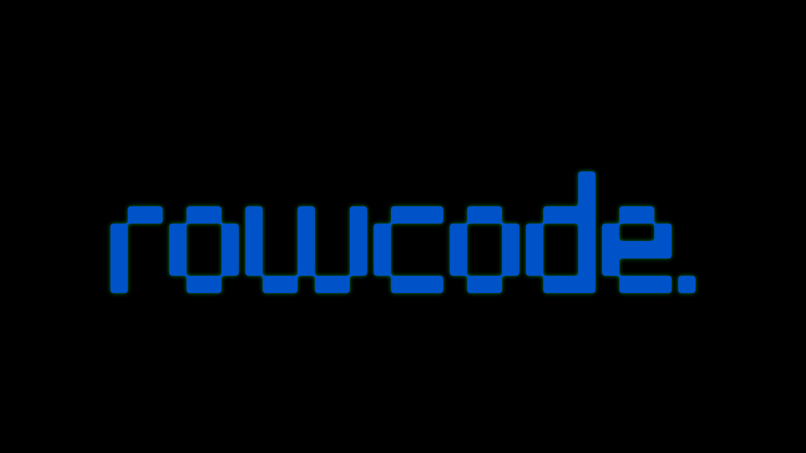

# RowCode - A Mobile-First Code Editor

 

RowCode is a simple, mobile-first code editor for HTML, CSS, and JavaScript that runs directly in your browser. It's designed for quick prototyping, learning, and testing web snippets on the go.

## Features

*   **Mobile-First Design:** A responsive interface that works seamlessly on both mobile and desktop devices.
*   **Live Preview:** See the results of your code in real-time in a separate preview tab.
*   **Syntax Highlighting:** (Coming Soon) Basic syntax highlighting for HTML, CSS, and JavaScript.
*   **Local Storage:** Your code is automatically saved to your browser's local storage, so you don't lose your work.
*   **PWA Support:** Install RowCode as a Progressive Web App for a native-like experience.
*   **No Backend Required:** Everything runs in the browser, making it fast and private.

## How to Use

1.  **Open the Editor:** Visit the [RowCode website](https://rownok.com/tool/code).
2.  **Select a Tab:** Choose between HTML, CSS, or JavaScript.
3.  **Write Your Code:** Start writing your code in the editor.
4.  **Run:** Click the "Run" button to open a live preview in a new tab.
5.  **Save:** Your code is automatically saved as you type. You can also manually save by clicking the "Save" button.
6.  **Clear:** Click the "Clear" button to clear all the code in the editors.

## Contributors

Thanks to all the contributors who have helped to improve this project.

## Contributing

Contributions are welcome! If you have any ideas, suggestions, or bug reports, please open an issue or submit a pull request on the [GitHub repository](https://github.com/rownok860/rowcode).

## License

This project is licensed under the MIT License - see the [LICENSE](LICENSE) file for details.
