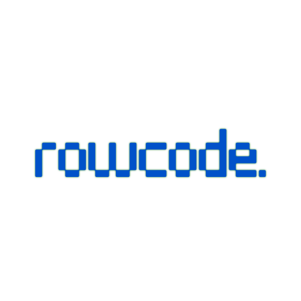

# RowCode

Code in your browser.

## Details

RowCode is a mobile-first code editor for HTML, CSS, and JavaScript that works in your browser. It's a simple and lightweight tool for web development on the go.

### Features:

*   **Mobile-First Design:** Optimized for touch devices.
*   **Live Preview:** See your changes in real-time.
*   **Syntax Highlighting:** (Coming Soon)
*   **Code Formatting:** Basic code formatting for HTML, CSS, and JS.
*   **Local Storage:** Your code is automatically saved to your browser's local storage.

### How to Use:

1.  Open `index.html` in your browser.
2.  Write your HTML, CSS, and JavaScript in the respective tabs.
3.  Click the "Run" button to see a preview of your code in a new tab.
4.  Your code is automatically saved as you type.

### Contributing

Contributions are welcome! Please feel free to submit a pull request or open an issue on the [GitHub repository](https://github.com/rownok860/rowcode).
